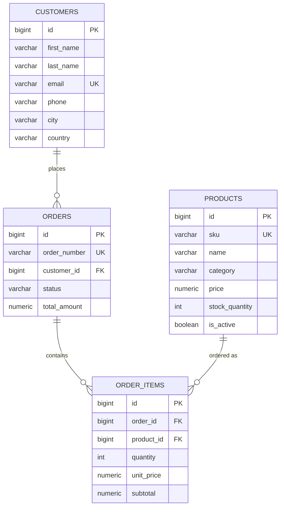

# ShopAssist Database Design

## Entities and relationships

Four entities model the ShopAssist e-commerce domain:

```
customers (1) ───< (N) orders (1) ───< (N) order_items (N) >─── (1) products
```

- **customers** — people who place orders.
- **products** — the catalog of items available for purchase.
- **orders** — one row per order header (status, totals, addresses).
- **order_items** — line items belonging to an order; the join between
  `orders` and `products`, carrying quantity and price at time of purchase.



### Why `unit_price`/`subtotal` are stored on `order_items`

Denormalized on purpose: a product's `price` can change after an order is
placed, so each order item snapshots the price paid at purchase time. This
is standard practice for order history integrity — never join back to
`products.price` to compute historical order totals.

### Foreign key delete behavior

- `orders.customer_id → customers.id` — `ON DELETE RESTRICT`. A customer
  with existing orders cannot be deleted outright, preserving order history.
- `order_items.order_id → orders.id` — `ON DELETE CASCADE`. Deleting an
  order removes its line items; there's no independent lifecycle for an
  order item without its parent order.
- `order_items.product_id → products.id` — `ON DELETE RESTRICT`. A product
  referenced by historical order items cannot be hard-deleted; deactivate it
  via `products.is_active = false` instead.

## Why schema, constraints, and indexes are separate files (PostgreSQL)

- **`schema.sql`** — table shape: columns, types, defaults, primary keys.
  This is what changes when you add a column.
- **`constraints.sql`** — foreign keys, `UNIQUE`, and `CHECK` constraints.
  Separating these means referential/business rules can be reviewed,
  migrated, or temporarily dropped (e.g. for a bulk load) independently of
  table shape.
- **`indexes.sql`** — indexes that exist purely for query performance.
  These are the first thing you tune under load, and tuning them shouldn't
  touch table or constraint definitions.

Each file is idempotent (`CREATE TABLE IF NOT EXISTS`, `CREATE INDEX IF NOT
EXISTS`, and a `pg_constraint` existence check before each `ALTER TABLE ADD
CONSTRAINT`), so re-running any of them against an already-initialized
database is a no-op rather than an error.

The SQLite schema (`sqlite/schema/schema.sql`) intentionally inlines
constraints and indexes into one file — SQLite is the lightweight local-dev
path, and there's no independent lifecycle to protect there.

## Naming conventions

- Tables: plural, `snake_case` (`order_items`, not `OrderItem`).
- Primary keys: always `id`.
- Foreign keys: `<referenced_table_singular>_id` (`customer_id`, `order_id`, `product_id`).
- Constraint names: `<type>_<table>_<column(s)>` — e.g. `fk_orders_customer`,
  `uq_products_sku`, `chk_orders_status`. Consistent prefixes make it easy to
  find "all foreign keys" (`fk_*`) or "all checks" (`chk_*`) in `pg_constraint`.
- Indexes: `idx_<table>_<column(s)>` — e.g. `idx_orders_customer_id`.
- Timestamps: `created_at` / `updated_at` (or `placed_at` for a
  domain-specific event time), always `TIMESTAMPTZ` in Postgres, UTC.

## Future migration strategy

Today, `postgres/schema/*.sql` is the single source of truth for a
brand-new database, and `postgres/migrations/` exists but is empty (see
[postgres/migrations/README.md](../postgres/migrations/README.md)).

As the schema evolves on databases that already hold data, add numbered
migration files (`0001_description.sql`, `0002_description.sql`, ...) to
`postgres/migrations/` rather than editing `schema.sql` retroactively:

1. Write the migration to be idempotent and safe against live data
   (`ADD COLUMN IF NOT EXISTS`, backfill in batches, guard constraint
   additions the same way `constraints.sql` does).
2. Apply it to each environment in order.
3. Update `schema.sql`/`constraints.sql`/`indexes.sql` to reflect the new
   baseline, so a fresh database created from scratch matches one that went
   through every migration.

Once there are more than a handful of migrations, adopt a dedicated tool
instead of hand-rolling the runner:

- **[golang-migrate](https://github.com/golang-migrate/migrate)** or
  **[Flyway](https://flywaydb.org/)** if migrations should be
  language-agnostic and driven by CI/CD.
- **[Alembic](https://alembic.sqlalchemy.org/)** if the application layer
  is Python and already uses SQLAlchemy.

Any of these track applied migrations in a version table, run outstanding
migrations in order, and support rollback — capabilities worth adopting
before the hand-rolled numbered-file convention gets unwieldy.

SQLite has no migration story by design: it's disposable local-dev data.
When the schema changes, developers run `sqlite/scripts/reset_db.py` to
rebuild from the current `schema.sql`/`seed.sql`.
